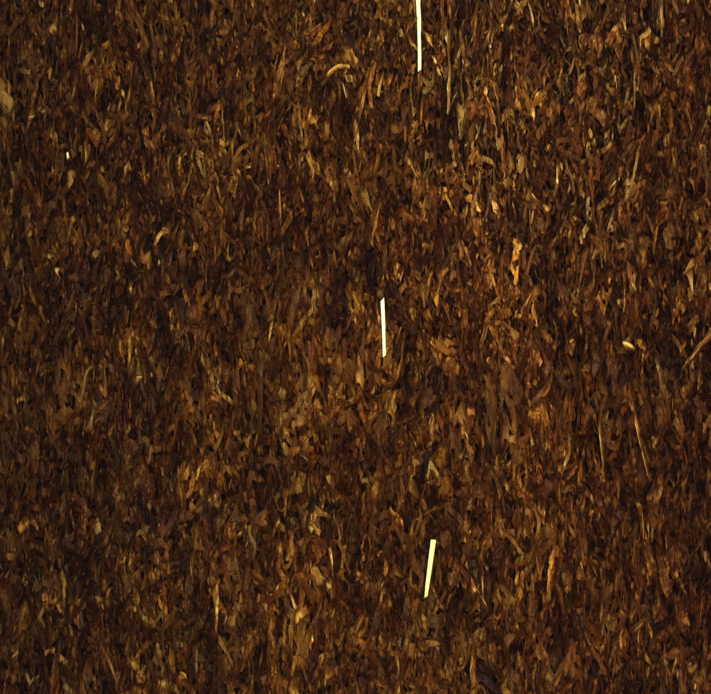
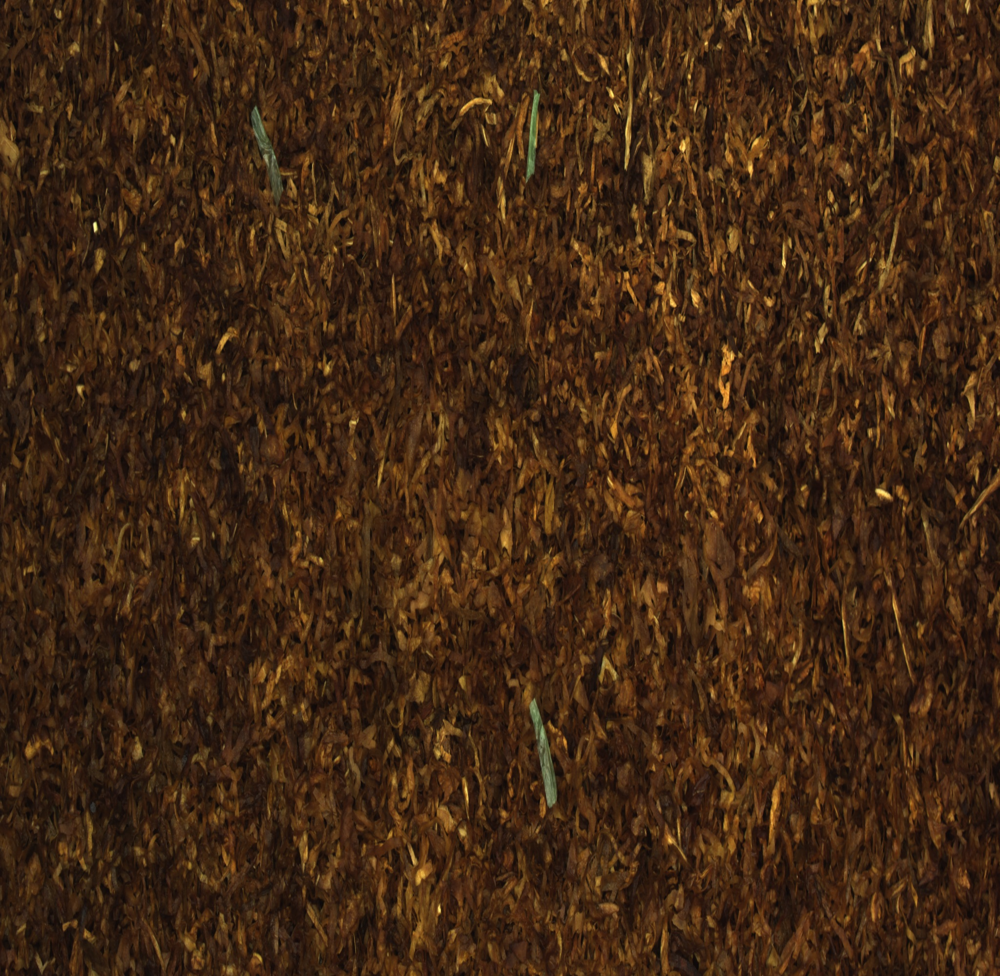

## 识别原理与效果

### 原理

对图像的 HSV 空间模型进行贝叶斯分类，首先针对如下示例背景做数据处理与分析：

- | - | -
--- | --- | ---
 |  | 

得到的数据做 H-V 和 H-S 散点图如下所示

H-V | H-S
--- | ---
 | 

由于要求运算精度并不高以及处理速度的要求，得出的趋势线方程如下：

> 5 * V - 13 * H = 600
> 5 * S - 17 * H = 500

所以确定合适的 HSV 阈值，就可以很好地识别背景

### 效果

No. | SOURCE | RESULT
--- | ------ | ------
1   |  | 
2   |  | 
3   |  | 
4   |  | 
5   |  | 
6   |  | 
7   |  | 
8   |  | 
9   |  | 
10   |  | 
11   |  | 
12   |  | 

### 说明

可以看到标号为 10 的图片识别效果不太好，对于这种肉眼都看不出来的图，我只想说：

# 我能怎么办，我 TM 也很无奈啊